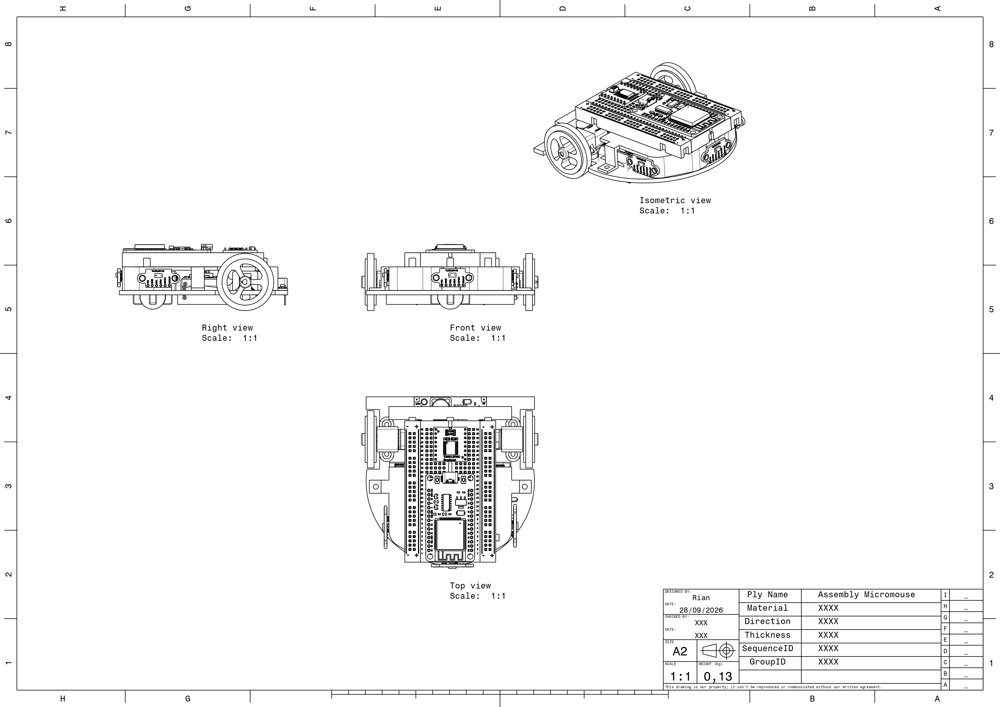
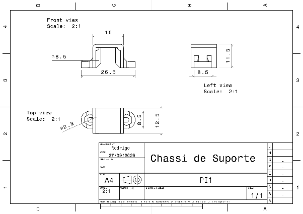
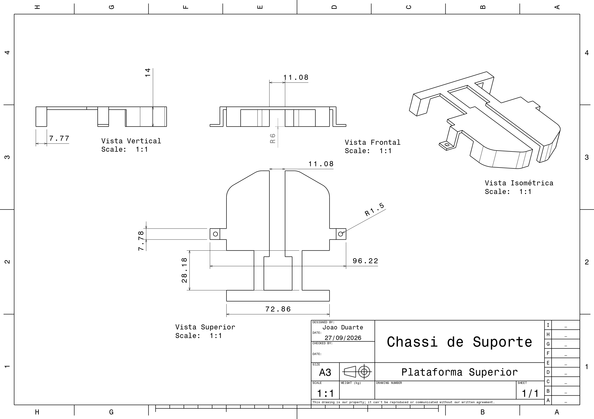
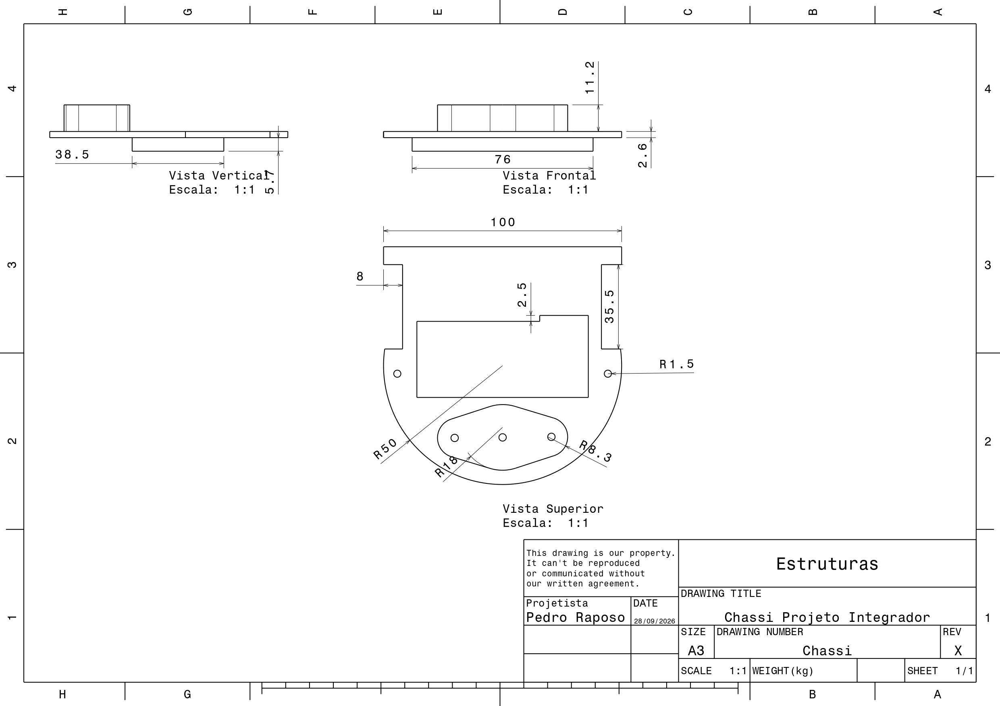

# Projeto Conceitual da Estrutura do Produto

## 1. Desenho em CAD e Drafting das Peças

### 1.1 Conjunto Montado

*Figura 1 – Assembly do micromouse (vistas lateral direita, frontal, superior e isométrica, escala 1:1). Massa estimada pelo CAD: 0,13 kg.*

### 1.2 Suporte dos Motores

*Figura 2 – Drafting do suporte dos motores (vistas frontal, superior e lateral, escala 2:1).*

Os suportes dos motores foram utilizados para realizar a fixação dos motores ao chassi de maneira segura e adequada. Esses componentes mantêm os motores alinhados e posicionados corretamente em relação às rodas, permitindo que a força produzida pelos motores seja transmitida de forma eficiente para o sistema de movimentação. Além disso, os suportes contribuem para a estabilidade do conjunto e reduzem a possibilidade de deslocamento ou vibração dos motores durante o funcionamento do carrinho.

### 1.3 Plataforma Superior

*Figura 3 – Drafting da plataforma superior (vistas vertical, frontal, superior e isométrica, escala 1:1).*

A plataforma superior foi utilizada para ampliar a área disponível para a instalação e organização dos componentes eletrônicos, como placa de controle, sensores, bateria e demais elementos necessários ao funcionamento do carrinho. Sua posição elevada em relação ao chassi permite melhor aproveitamento do espaço interno, evitando que os componentes interfiram diretamente no sistema de movimentação e facilitando o acesso para montagem e manutenção.

### 1.4 Chassi

*Figura 4 – Drafting do chassi (vistas vertical, frontal e superior, escala 1:1).*

## 2. Materiais Utilizados

| **Componente** | **Material** | **Justificativa** |
| -------------- | ------------ | ----------------- |
| Chassi | PLA | Custo-benefício, facilidade de impressão 3D, baixo peso e rigidez suficiente para sustentar os componentes do carrinho. |
| Plataforma Superior | PLA | Baixo peso, facilidade de fabricação e resistência adequada para suportar a protoboard, o ESP32 e demais componentes eletrônicos. |
| Suporte dos Motores | PLA | Facilidade de fabricação, baixo custo e rigidez suficiente para manter os motores N20 corretamente fixados e alinhados. |
| Rodas | Borracha | Proporciona maior aderência ao solo, reduzindo o deslizamento e melhorando a transmissão da força dos motores para o deslocamento do carrinho. |
| Roda deslizante | Aço | Baixo peso e baixa resistência ao movimento, proporcionando apoio à parte frontal do carrinho sem prejudicar significativamente sua capacidade de deslocamento. |

## 3. Partes Fundamentais

- **Chassi:** base principal do robô. Suporta motores, bateria, sensores e toda a eletrônica. Projetado com recortes laterais para encaixe das rodas e dos suportes.
- **Suporte dos Motores (×2):** fixam os motores N20 ao chassi de forma alinhada e segura, garantindo que o torque seja transmitido corretamente às rodas.
- **Plataforma Superior:** segundo andar do chassi, que abriga a protoboard, o ESP32 e outros componentes. Permite a organização dos componentes sem interferir no sistema de tração.
- **Esfera deslizante:** forma um tripé estável com as duas rodas motorizadas. Rola livremente em qualquer direção.
- **Motores N20:** micromotores com caixa de redução. Fornecem tração diferencial para navegação e giro.

## 4. Explicação do Desenho

### 4.1 Suporte dos Motores

Os suportes dos motores são responsáveis pela fixação dos motores N20 à estrutura do carrinho. Os motores estão associados aos encoders, que permitem obter informações sobre a rotação das rodas e auxiliar no controle do deslocamento. As rodas são acopladas diretamente aos motores, possibilitando a transmissão do movimento gerado pelos motores para o sistema de locomoção do carrinho. Os suportes garantem o posicionamento adequado dos motores e contribuem para manter o alinhamento entre motores e rodas durante o funcionamento.

### 4.2 Plataforma Superior

Na parte superior do carrinho estão posicionados três sensores a laser, direcionados para a frente e para as laterais, permitindo a detecção do ambiente ao redor do veículo. Também está localizada uma protoboard, responsável por realizar as conexões elétricas entre os diferentes componentes do sistema. Nela estão conectados o ESP32 e a ponte H, permitindo a integração entre o sistema de controle e o acionamento dos motores.

### 4.3 Chassi

O chassi ocupa a maior parte da estrutura do carrinho e funciona como a principal base para a instalação dos componentes. A bateria está posicionada de forma centralizada, contribuindo para uma melhor distribuição de massa e estabilidade do conjunto. Também estão instalados no chassi os motores N20 e três reguladores de tensão, sendo cada um destinado a uma linha de alimentação com faixa de tensão distinta. O módulo sensor de corrente INA219 é utilizado para realizar o monitoramento elétrico do sistema. Além dele, está instalado o giroscópio, responsável pela obtenção de informações relacionadas à orientação e ao movimento do carrinho. Na parte frontal do chassi encontra-se um eixo com uma esfera deslizante, que funciona como ponto de apoio para o deslocamento do carrinho, permitindo que a estrutura se movimente com menor resistência.

## 5. Justificativa das Principais Decisões de Projeto

| **Decisão** | **Justificativa** |
| ----------- | ----------------- |
| Material PLA | Custo-benefício e disponibilidade. |
| Arquitetura em dois andares | Separa a bateria da eletrônica (andar superior, mais leve), o que melhora a distribuição de massa. |
| Roda deslizante | Permite rodar livremente em qualquer direção sem atraso de alinhamento, o que reduz o erro odométrico nos giros. |
| Rodas de borracha para motor N20 | Rodas de PLA não possuem a mesma aderência que rodas de borracha. Isso garante menos folga e vibração no sistema de tração. |
| Uso de parafusos nos eixos | Os parafusos integram os dois andares do projeto (chassi e plataforma superior), garantindo firmeza e rigidez à estrutura. |
