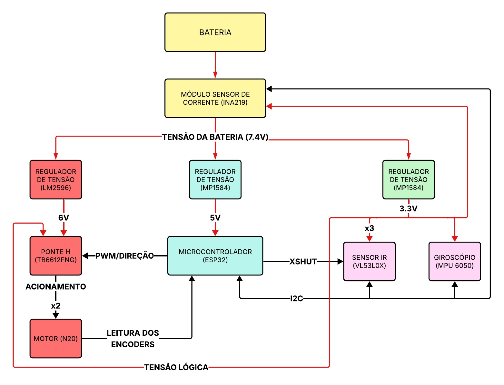
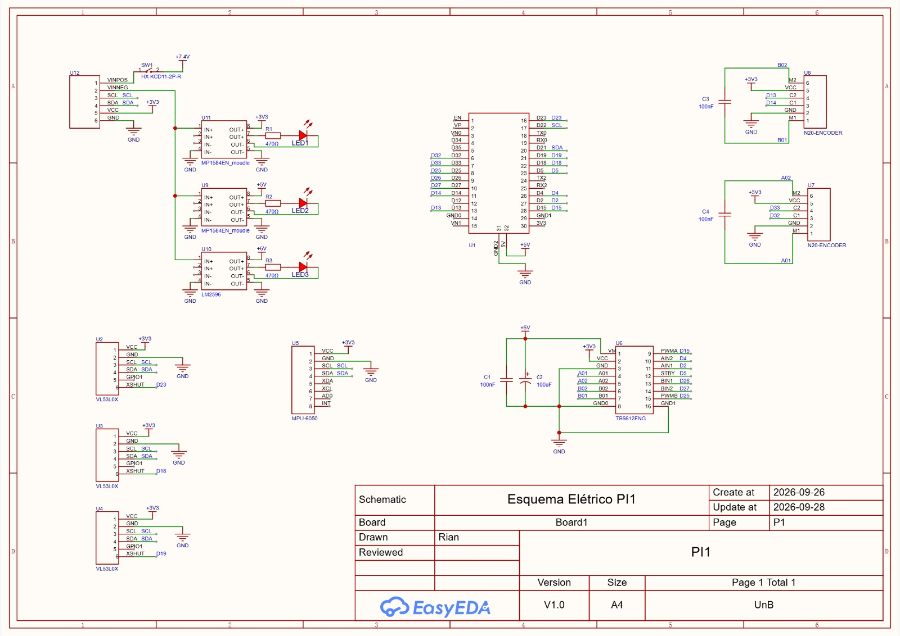

# Projeto Conceitual de _Hardware_

O hardware do Micromouse é organizado em torno de um microcontrolador **ESP32** que centraliza o processamento e a comunicação de quatro subsistemas elétricos: **processamento e controle**, **sensoriamento**, **atuação e locomoção** e **alimentação e telemetria**, além de um conjunto de componentes passivos de filtragem e sinalização que dá suporte aos quatro.

## Diagrama de Blocos

<figure>

<figcaption>

**Figura 1.** Diagrama de blocos do hardware do Micromouse. Setas vermelhas indicam trilhas de alimentação (tensão de bateria e linhas reguladas); setas pretas indicam sinais de dados e controle (I2C, PWM, XSHUT e leitura de encoders).

</figcaption>

</figure>

A bateria alimenta diretamente o módulo sensor de corrente **INA219**, que mede a tensão e a corrente totais consumidas pelo robô antes de distribuí-las às três linhas reguladas: 6V para a ponte H e os motores, 5V para o ESP32 e 3,3V para a lógica dos sensores. O ESP32 opera como hub central, trocando sinais PWM/direção com a ponte H, lendo os encoders dos motores e comunicando-se via barramento I2C com os sensores ToF (endereçados dinamicamente pelos pinos XSHUT) e o giroscópio.

## Esquemático Elétrico

<figure>

<figcaption>

**Figura 2.** Esquemático elétrico completo do Micromouse, com componentes, símbolos, pinagem e conexões. Arquivo-fonte disponível em [`hw/Esquema Elétrico.pdf`](<../hw/Esquema Elétrico.pdf>) (EasyEDA).

</figcaption>

</figure>

O esquemático foi desenhado no EasyEDA (não em _protoboard_) e mostra a pinagem completa do ESP32-DEVKIT (30 pinos), das três unidades VL53L0X, do MPU-6050, da ponte H TB6612FNG, dos dois módulos encoder N20, dos três conversores _step-down_ e dos componentes passivos de filtragem e sinalização. O diagrama de blocos correspondente está em [`hw/Diagrama de Blocos.pdf`](<../hw/Diagrama de Blocos.pdf>).

## Subsistemas

### 1. Processamento e Controle

| Componente | Designador | Função | Interface |
|:-----------|:----------:|:-------|:----------|
| ESP32-WROOM-32 (DEVKIT 30 pinos) | U1 | CPU do robô: navegação, PID de motores, telemetria | GPIO, I2C, PWM (LEDC), interrupções |

O ESP32 foi escolhido por seu processador dual-core Xtensa LX6 (até 240 MHz), que permite dedicar um núcleo à tomada de decisão (mapeamento/_Flood Fill_) e o outro ao controle em tempo real (PID e leitura de encoders). Seus periféricos nativos de I2C, geradores de PWM de alta precisão (LEDC) e sistema de interrupções eliminam a necessidade de um segundo microcontrolador dedicado à leitura de encoders. A memória RAM (520 KB) e Flash (4 MB) comporta a matriz do labirinto e os registros de telemetria sem necessidade de armazenamento externo. O rádio Wi-Fi embutido viabiliza a transmissão de telemetria sem hardware adicional.

### 2. Sensoriamento

| Componente | Designador | Função | Interface |
|:-----------|:----------:|:-------|:----------|
| VL53L0X (×3) | U2, U3, U4 | Distância às paredes (frontal, esquerda, direita) | I2C + GPIO (XSHUT) |
| MPU-6050 | U5 | Giroscópio/acelerômetro (odometria inercial) | I2C |
| Regulador MP1584 (3,3V) | U11 | Alimentação lógica dos sensores | Potência |

Os três sensores de distância a laser **VL53L0X** usam tecnologia Time-of-Flight: em vez de medir a intensidade da luz infravermelha refletida (sujeita à cor da parede e à luz ambiente, como em fototransistores IR tradicionais), medem o tempo de voo de um pulso de laser de 940 nm, garantindo leituras milimétricas e consistentes independentemente da superfície. Como os três módulos compartilham o mesmo endereço I2C de fábrica, o ESP32 controla individualmente o pino **XSHUT** de cada um para inicializá-los em sequência e atribuir endereços lógicos exclusivos no _boot_.

O **MPU-6050** fornece a velocidade angular no eixo Z, permitindo validar curvas de 90°/180° e corrigir o desvio em linha reta, complementando (e não substituindo) a odometria por encoder, eliminando o escorregamento das rodas como única fonte de erro na navegação.

### 3. Atuação e Locomoção

| Componente | Designador | Função | Interface |
|:-----------|:----------:|:-------|:----------|
| Ponte H TB6612FNG | U6 | Acionamento bidirecional dos motores | PWM, GPIO (STBY) |
| Motor DC N20 + encoder magnético (×2) | U7, U8 | Tração e realimentação de posição/velocidade | PWM (entrada) / GPIO (encoder) |
| Regulador LM2596 (6V) | U10 | Alimentação regulada da ponte H e motores | Potência |

A ponte H **TB6612FNG** foi escolhida por sua tecnologia MOSFET, com resistência de condução (Rds(on)) muito menor que a de drivers bipolares tradicionais (ex.: L298N), reduzindo a queda de tensão e a dissipação térmica. Suporta até 1,2 A contínuos por canal (picos de 3,2 A), compatível com a aceleração exigida no _speed run_. O pino **STBY** mantido em nível lógico alto permite o freio dinâmico por curto-circuito induzido das bobinas do motor.

Os motores **N20** com caixa de redução metálica oferecem alto torque de arranque com baixa inércia rotacional, e seus encoders magnéticos de quadratura (canais A/B) permitem o cálculo do deslocamento por contagem de pulsos e o ajuste contínuo via PID. O diâmetro de 34 mm das rodas foi dimensionado para equilibrar velocidade linear máxima e torque nas curvas. O detalhamento mecânico completo está em [4.1 - Projeto conceitual de estruturas](<4.1 - Projeto conceitual de estruturas.md>).

### 4. Alimentação e Telemetria

| Componente | Designador | Função | Interface |
|:-----------|:----------:|:-------|:----------|
| Bateria LiPo 7,4V + chave KCD11-2P-R | — / SW1 | Fonte primária e seccionamento do circuito | Potência |
| Sensor de tensão/corrente INA219 | U12 | Medição da tensão e corrente da bateria | I2C |
| Regulador MP1584 (5V) | U9 | Alimentação regulada do ESP32 | Potência |

O **INA219** avalia continuamente o nível de carga da bateria de 7,4V, prevenindo danos por descarga profunda e detectando picos anormais de corrente que indicam travamento mecânico das rodas ou sobrecarga dos motores, dado repassado ao ESP32 via I2C para telemetria. As três linhas de alimentação (6V para motores, 5V para o ESP32, 3,3V para sensores) são geradas por conversores _step-down_ independentes, isolando eletricamente a linha de potência dos motores das linhas lógicas e evitando que ruídos das escovas dos motores afetem o processador ou as leituras dos sensores. O cálculo de consumo, a margem de autonomia e o dimensionamento da bateria estão detalhados em [4.2 - Projeto conceitual de energia](<4.2 - Projeto conceitual de energia.md>).

### 5. Componentes Passivos e Sinalização

| Componente | Designador | Função |
|:-----------|:----------:|:-------|
| Capacitor eletrolítico 100 µF | C2 | Absorve picos de corrente na partida dos motores, evitando afundamento de tensão na linha de 6V |
| Capacitor cerâmico 100 nF | C1 | Desacoplamento de alta frequência na linha de 6V, junto à ponte H |
| Capacitores cerâmicos 100 nF (×2) | C3, C4 | Desacoplamento no pino VCC de cada módulo encoder N20 |
| LEDs indicadores + resistores limitadores 470 Ω (×3) | LED1–3, R1–3 | Sinalização visual dos barramentos de 3,3V, 5V e 6V |
| Chave gangorra KCD11-2P-R | SW1 | Partida física e corte de energia |

## _Datasheets_

Os _datasheets_ de todos os componentes eletrônicos utilizados estão disponíveis em [`hw/datasheets`](../hw/datasheets/): ESP32-WROOM-32, VL53L0X, MPU-6050, INA219, TB6612FNG, LM2596, MP1584, e encoder magnético N20.
