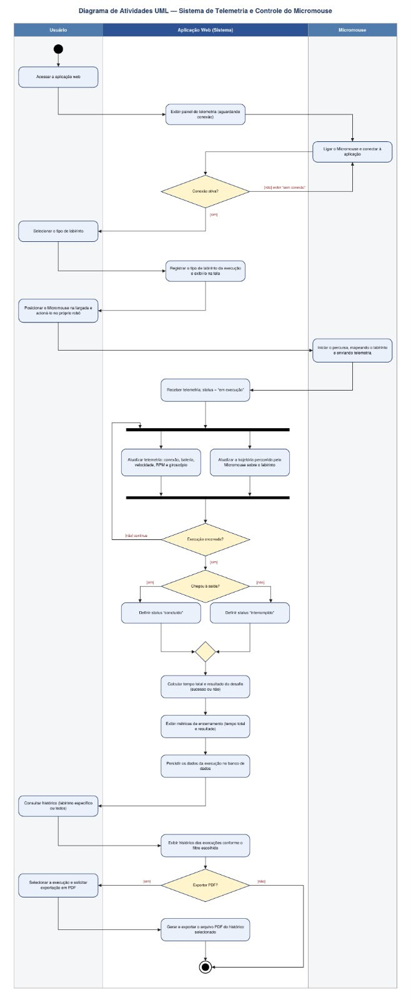
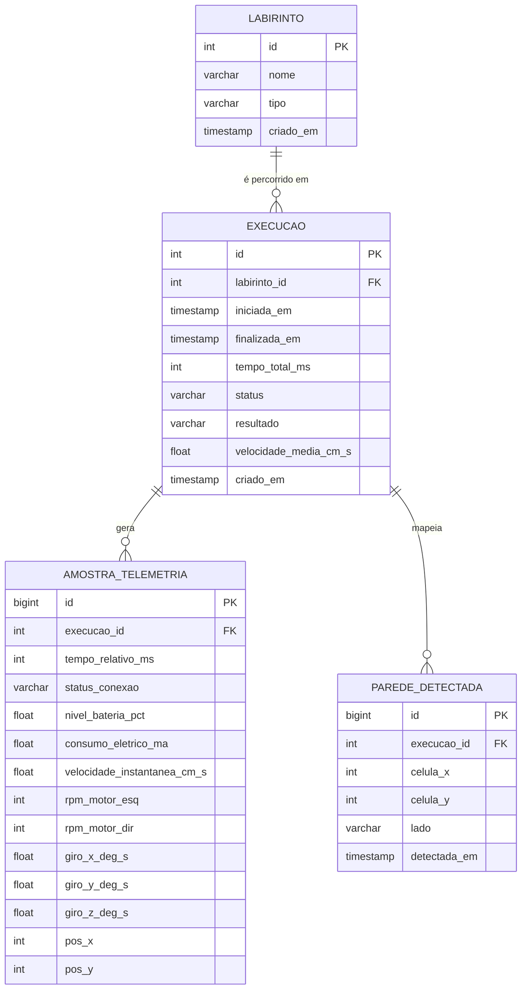

# Projeto Conceitual de Software

## Diagrama de Atividades UML

O diagrama abaixo descreve o fluxo funcional completo do sistema de telemetria e controle do Micromouse, organizado em três raias (_swimlanes_): **Usuário**, **Aplicação Web (Sistema)** e **Micromouse**.

**Atores envolvidos:**

- **Usuário:** pessoa que opera a aplicação web e posiciona/aciona o Micromouse antes de cada execução.
- **Aplicação Web (Sistema):** recebe a telemetria, processa, exibe em tempo real, calcula métricas de encerramento e persiste os dados no banco de dados.
- **Micromouse:** robô autônomo que mapeia o labirinto, executa o percurso e transmite telemetria continuamente durante a execução.

**Fluxo principal:**

1. O usuário acessa a aplicação web, que exibe o painel de telemetria aguardando conexão com o Micromouse.
2. O Micromouse é ligado e conecta-se à aplicação. Caso a conexão não seja estabelecida, o sistema permanece exibindo "sem conexão" até que ela ocorra.
3. Com a conexão ativa, o usuário seleciona o tipo de labirinto, que é registrado e exibido na tela; em seguida posiciona o Micromouse na largada e o aciona.
4. O Micromouse inicia o percurso, mapeando o labirinto e enviando telemetria continuamente; o sistema passa a exibir o status "em execução".
5. Em paralelo (barra de bifurcação/sincronização), o sistema **atualiza a telemetria** (conexão, bateria, velocidade, RPM, giroscópio) e **atualiza a trajetória** percorrida sobre o mapa do labirinto.
6. Ao final da execução, o sistema verifica se o Micromouse chegou à saída, definindo o status como "concluído" ou "interrompido".
7. O sistema calcula o tempo total e o resultado do desafio, exibe as métricas de encerramento e persiste os dados da execução no banco de dados.
8. O usuário pode consultar o histórico (por labirinto específico ou geral), e o sistema exibe as execuções conforme o filtro escolhido.
9. Por fim, o usuário pode optar por exportar o histórico selecionado em PDF, encerrando o fluxo.

## Backlog do Produto

O backlog do produto está documentado integralmente no GitHub Issues do repositório do grupo. Cada Requisito Funcional (RF) e Não-Funcional (RNF) é cadastrado como uma **issue do tipo Épico**, e cada História de Usuário (HU) é uma **issue própria, vinculada como sub-issue (relação pai/filho nativa do GitHub)** do RF/RNF ao qual pertence. Todas as HUs contêm descrição no formato _Eu-Como-Para_ e critérios de aceitação documentados diretamente na issue.

> Esta seção cobre os requisitos de **Software (RF-SW/RNF-SW)**. Os requisitos das demais áreas (Eletrônica, Estruturas, Energia) são tratados em seus respectivos documentos de projeto conceitual.

### Requisitos Funcionais

<u>RF-SW01/Épico: Telemetria em Tempo de Execução</u>

| ID (Link Github Projects)                                              | Título                   | Prioridade |
| :--------------------------------------------------------------------- | :----------------------- | :--------- |
| [HU-01](https://github.com/fcte-pi1/2026.2_PI1_Grupo2_Diogo/issues/47) | Exibir telemetria (RF01) | Must have  |

<u>RF-SW02/Épico: Mapeamento e Visualização da Trajetória</u>

| ID (Link Github Projects)                                              | Título                                                           | Prioridade |
| :--------------------------------------------------------------------- | :--------------------------------------------------------------- | :--------- |
| [HU-02](https://github.com/fcte-pi1/2026.2_PI1_Grupo2_Diogo/issues/48) | Mapeamento e Navegação                                           | Must have  |
| [HU-03](https://github.com/fcte-pi1/2026.2_PI1_Grupo2_Diogo/issues/49) | Exibir trajetória e posição atual do Micromouse (RF02 — parte 2) | Must have  |

<u>RF-SW03/Épico: Navegação e Resolução Autônoma de Labirinto</u>

| ID (Link Github Projects)                                              | Título                                                 | Prioridade |
| :--------------------------------------------------------------------- | :----------------------------------------------------- | :--------- |
| [HU-17](https://github.com/fcte-pi1/2026.2_PI1_Grupo2_Diogo/issues/81) | Exploração e mapeamento autônomo do labirinto          | Must have  |
| [HU-18](https://github.com/fcte-pi1/2026.2_PI1_Grupo2_Diogo/issues/82) | Cálculo e execução da rota ótima até a célula objetivo | Must have  |

<u>RF-SW04/Épico: Gestão e Consulta de Histórico de Corridas</u>

| ID (Link Github Projects)                                              | Título                                                                   | Prioridade |
| :--------------------------------------------------------------------- | :----------------------------------------------------------------------- | :--------- |
| [HU-04](https://github.com/fcte-pi1/2026.2_PI1_Grupo2_Diogo/issues/42) | Modelagem do banco de dados para histórico de execuções (RF04 — parte 1) | Must have  |
| [HU-05](https://github.com/fcte-pi1/2026.2_PI1_Grupo2_Diogo/issues/43) | Endpoint de consulta de histórico (RF04-2)                               | Must have  |
| [HU-06](https://github.com/fcte-pi1/2026.2_PI1_Grupo2_Diogo/issues/50) | Desempenho e Avaliação — exibir métricas de encerramento (RF03)          | Must have  |
| [HU-07](https://github.com/fcte-pi1/2026.2_PI1_Grupo2_Diogo/issues/51) | Tela de consulta de histórico (RF04-3)                                   | Must have  |

<u>RF-SW05/Épico: Emissão e Exportação de Relatórios de Desempenho</u>

| ID (Link Github Projects)                                              | Título                                                    | Prioridade |
| :--------------------------------------------------------------------- | :-------------------------------------------------------- | :--------- |
| [HU-08](https://github.com/fcte-pi1/2026.2_PI1_Grupo2_Diogo/issues/46) | Geração do arquivo PDF de histórico (RF05 — backend)      | Could have |
| [HU-09](https://github.com/fcte-pi1/2026.2_PI1_Grupo2_Diogo/issues/52) | Relatórios — botão de exportação em PDF (RF05 — frontend) | Could have |

### Requisitos Não-Funcionais

<u>RNF-SW01/Épico: Atualização Contínua de Telemetria</u>

| ID (Link Github Projects)                                              | Título                                     | Prioridade |
| :--------------------------------------------------------------------- | :----------------------------------------- | :--------- |
| [HU-10](https://github.com/fcte-pi1/2026.2_PI1_Grupo2_Diogo/issues/41) | Atualização contínua da telemetria (RNF01) | Must have  |

<u>RNF-SW02/Épico: Arquitetura Web Responsiva</u>

| ID (Link Github Projects)                                              | Título                                     | Prioridade |
| :--------------------------------------------------------------------- | :----------------------------------------- | :--------- |
| [HU-11](https://github.com/fcte-pi1/2026.2_PI1_Grupo2_Diogo/issues/53) | Infraestrutura — setup do frontend (RNF02) | Must have  |
| [HU-12](https://github.com/fcte-pi1/2026.2_PI1_Grupo2_Diogo/issues/54) | Setup do backend (RNF02)                   | Must have  |

<u>RNF-SW03/Épico: Compatibilidade de Navegadores</u>

| ID (Link Github Projects)                                              | Título                                              | Prioridade |
| :--------------------------------------------------------------------- | :-------------------------------------------------- | :--------- |
| [HU-13](https://github.com/fcte-pi1/2026.2_PI1_Grupo2_Diogo/issues/55) | Testes de compatibilidade entre navegadores (RNF03) | Must have  |

<u>RNF-SW04/Épico: Disponibilidade da Sessão de Telemetria</u>

| ID (Link Github Projects)                                              | Título                                                           | Prioridade |
| :--------------------------------------------------------------------- | :--------------------------------------------------------------- | :--------- |
| [HU-14](https://github.com/fcte-pi1/2026.2_PI1_Grupo2_Diogo/issues/45) | Garantir disponibilidade dos dados durante conexão ativa (RNF04) | Must have  |

<u>RNF-SW05/Épico: Integridade e Persistência de Dados</u>

| ID (Link Github Projects)                                              | Título                        | Prioridade |
| :--------------------------------------------------------------------- | :---------------------------- | :--------- |
| [HU-15](https://github.com/fcte-pi1/2026.2_PI1_Grupo2_Diogo/issues/44) | Integridade dos dados (RNF05) | Must have  |

<u>RNF-SW06/Épico: Tempo Limite de Resolução</u>

| ID (Link Github Projects)                                              | Título                                                  | Prioridade |
| :--------------------------------------------------------------------- | :------------------------------------------------------ | :--------- |
| [HU-16](https://github.com/fcte-pi1/2026.2_PI1_Grupo2_Diogo/issues/56) | Validar tempo de resolução do labirinto < 10min (RNF06) | Must have  |

## Descrição da Arquitetura da Solução de Software

### Propósito do software

O software é o elo entre o Micromouse e a equipe/avaliadores: recebe a telemetria transmitida pelo robô durante cada corrida, exibe o mapeamento e a trajetória em tempo real, calcula e apresenta as métricas de encerramento, e persiste cada execução para consulta histórica e emissão de relatórios em PDF.

### Padrão adotado

**Monolítico**, no que se refere à aplicação web (frontend + backend). O código-fonte é organizado em camadas físicas separadas (`src/frontend`, `src/backend` e `src/firmware`), mas a aplicação web (frontend + backend) é versionada, implantada e mantida como um único sistema coeso, sem decomposição em serviços independentes. O firmware embarcado (`src/firmware`), que roda na ESP32 do Micromouse, é necessariamente um componente à parte — não por escolha de decomposição em serviços, mas porque executa em hardware fisicamente distinto e se comunica com o backend apenas por telemetria via rede sem fio. A escolha do monólito para a aplicação web se justifica pelo escopo contido (telemetria, mapeamento, histórico e relatórios), pelo tamanho da equipe de software e pelo prazo do semestre letivo, que favorecem simplicidade de desenvolvimento, deploy e depuração em detrimento da escalabilidade independente que uma arquitetura de microsserviços proporcionaria.

### Linguagens de programação

- **Backend (API REST):** Python.
- **Firmware (ESP32 do Micromouse):** MicroPython.
- **Frontend:** TypeScript.

### _Frameworks_ e bibliotecas

- **Frontend:** React com Vite (build tool/dev server), para construção da interface em componentes (painel de telemetria, mapa do labirinto, histórico e relatórios).
- **Backend:** FastAPI, para a API REST que recebe a telemetria do firmware, expõe os endpoints consumidos pelo frontend e faz a mediação com o PostgreSQL.
- **Firmware:** bibliotecas padrão do MicroPython (rede/Wi-Fi, I2C/GPIO) para leitura dos sensores, controle dos motores e envio de telemetria à API REST.

### Banco de dados

**Relacional — PostgreSQL.** A natureza estruturada e fortemente relacionada dos dados (labirintos, execuções e telemetria histórica associada a cada execução) favorece um modelo relacional, além de oferecer transações ACID, exigidas para atender ao RNF-SW05 (Integridade e Persistência de Dados).

### Persistência de dados

O banco de dados relacional (PostgreSQL) foi modelado a partir dos dados que os requisitos de software exigem persistir: o(s) labirinto(s) cadastrados, cada execução (corrida) realizada sobre um labirinto, a telemetria amostrada durante essa execução (RF-SW01) e as paredes detectadas durante o mapeamento (RF-SW02), permitindo a consulta histórica (RF-SW04) e a geração de relatórios (RF-SW05) sem perda de rastreabilidade entre os dados (RNF-SW05).

#### Modelo Entidade-Relacionamento (MER)

**Entidades e atributos:**

| Entidade                  | Atributos                                                                                                                                                                                                                                           | Observações                                                                                                                                                |
| :------------------------ | :-------------------------------------------------------------------------------------------------------------------------------------------------------------------------------------------------------------------------------------------------- | :--------------------------------------------------------------------------------------------------------------------------------------------------------- |
| **Labirinto**             | `id` (PK), `nome`, `tipo` (4×4, 8×4 ou 12×4), `criado_em`                                                                                                                                                                                           | Cadastro dos labirintos utilizados nos desafios.                                                                                                           |
| **Execução**              | `id` (PK), `labirinto_id` (FK), `iniciada_em`, `finalizada_em`, `tempo_total_ms`, `status` (em execução / concluído / interrompido), `resultado` (sucesso / falha), `velocidade_media_cm_s`, `criado_em`                                            | Uma corrida completa do Micromouse sobre um labirinto (RF-SW04).                                                                                           |
| **Amostra de Telemetria** | `id` (PK), `execucao_id` (FK), `tempo_relativo_ms`, `status_conexao`, `nivel_bateria_pct`, `consumo_eletrico_ma`, `velocidade_instantanea_cm_s`, `rpm_motor_esq`, `rpm_motor_dir`, `giro_x_deg_s`, `giro_y_deg_s`, `giro_z_deg_s`, `pos_x`, `pos_y` | Série temporal de leituras recebidas durante a execução, no intervalo definido pelo RNF-SW01; `pos_x`/`pos_y` permitem reconstruir a trajetória (RF-SW02). |
| **Parede Detectada**      | `id` (PK), `execucao_id` (FK), `celula_x`, `celula_y`, `lado` (norte / sul / leste / oeste), `detectada_em`                                                                                                                                         | Paredes mapeadas pelo Micromouse durante a exploração de uma execução (RF-SW02, RF-SW03).                                                                  |

**Relacionamentos:**

- Um **Labirinto** pode ser percorrido em várias **Execuções** (1:N) — o mesmo labirinto físico é reutilizado em múltiplas corridas.
- Uma **Execução** gera várias **Amostras de Telemetria** (1:N) — uma amostra a cada intervalo de atualização.
- Uma **Execução** mapeia várias **Paredes Detectadas** (1:N).

#### Diagrama Entidade-Relacionamento (DER)

As chaves estrangeiras entre `execucao`, `amostra_telemetria` e `parede_detectada`, e a unicidade de cada parede por execução, atendem diretamente ao RNF-SW05 (Integridade e Persistência de Dados), garantindo consistência referencial e evitando estados parciais ou corrompidos no histórico. A implementação física (script SQL de criação das tabelas) cabe à etapa de desenvolvimento do backend, não a este documento conceitual.

### Visões da arquitetura (4+1)

- **Visão lógica:** módulos conceituais de Telemetria, Mapeamento/Trajetória, Histórico e Relatórios, que consomem os dados recebidos do firmware do Micromouse e os expõem à interface web.
- **Visão de processos:** o firmware (MicroPython/ESP32) transmite telemetria continuamente durante a execução via Wi-Fi; a API REST (Python/FastAPI) recebe, processa e disponibiliza esses dados ao frontend, que os exibe e atualiza em intervalos regulares; ao término da execução, o backend calcula as métricas finais e persiste o registro no PostgreSQL.
- **Visão de implementação:** repositório único dividido em `src/frontend` (aplicação React), `src/backend` (API REST em Python/FastAPI) e `src/firmware` (MicroPython, embarcado na ESP32 do Micromouse); frontend e backend se comunicam por API HTTP/REST, e o firmware envia telemetria ao backend pela mesma API.
- **Visão de implantação:** o backend (Python/FastAPI) roda em um servidor acessível pela rede Wi-Fi do ambiente de competição; o firmware (MicroPython) roda embarcado na ESP32, a bordo do Micromouse; o frontend é servido como aplicação web; o banco de dados PostgreSQL é hospedado separadamente do backend.
- **Visão de dados:** ver MER/DER na subseção "Persistência de dados", acima.

## Roteiro de Testes Funcionais

Roteiro elaborado a partir dos Requisitos Funcionais (RF-SW01, RF-SW02, RF-SW04 e RF-SW05) e dos Requisitos Não-Funcionais aplicáveis (RNF-SW01, RNF-SW03, RNF-SW04, RNF-SW05 e RNF-SW06).

> **RF-SW03** (navegação e resolução autônoma do labirinto) não possui caso de teste funcional dedicado neste roteiro: é um requisito de _firmware_ embarcado do Micromouse, não de interface web, e por isso está fora do escopo de um roteiro de testes funcionais da aplicação. Ele é indiretamente validado pelo RNF-SW06-T01 (tempo de resolução do labirinto), mas deve receber casos de teste específicos de firmware/hardware, a definir pela equipe responsável por RF-SW03.

#### [RF-SW01](https://github.com/fcte-pi1/2026.2_PI1_Grupo2_Diogo/issues/2) — Telemetria em Tempo de Execução

| Código                 | Nome                                    | Rastreabilidade                                                         | Objetivo                                                              | Pré-condições                                           | Procedimento                                                                                                                                                                                                                                                                                          | Resultado Esperado                                                                                                                            |
| :--------------------- | :-------------------------------------- | :---------------------------------------------------------------------- | :-------------------------------------------------------------------- | :------------------------------------------------------ | :---------------------------------------------------------------------------------------------------------------------------------------------------------------------------------------------------------------------------------------------------------------------------------------------------- | :-------------------------------------------------------------------------------------------------------------------------------------------- |
| RF-SW01-T01            | Exibição da telemetria em execução      | [RF-SW01](https://github.com/fcte-pi1/2026.2_PI1_Grupo2_Diogo/issues/2) | Verificar se todos os campos de telemetria são exibidos e atualizados | Micromouse ligado e conectado à aplicação web           | 1. Ligar o Micromouse e aguardar conexão. 2. Iniciar a execução no labirinto. 3. Acessar a aplicação web. 4. Localizar o painel de telemetria. 5. Verificar status de conexão, consumo de bateria, estimativa de recarga, velocidade média, RPM e giroscópio. 6. Aguardar 30s observando as mudanças. | Os 6 campos aparecem com valores válidos (não nulos/zerados indevidamente) e se atualizam continuamente durante o movimento.                  |
| RF-SW01-T02            | Atualização do status ao perder conexão | [RF-SW01](https://github.com/fcte-pi1/2026.2_PI1_Grupo2_Diogo/issues/2) | Verificar a transição de status ao desconectar                        | Micromouse conectado e status "conectado"               | 1. Confirmar status "conectado". 2. Desligar o Micromouse ou o módulo de comunicação. 3. Cronometrar o tempo. 4. Observar o painel de status.                                                                                                                                                         | O status muda para "desconectado" dentro do timeout definido pelo projeto, sem travar a interface ou exibir dados desatualizados como atuais. |
| RF-SW01-T03            | Estimativa de recarga com bateria baixa | [RF-SW01](https://github.com/fcte-pi1/2026.2_PI1_Grupo2_Diogo/issues/2) | Verificar coerência da estimativa de recarga com bateria baixa        | Micromouse com bateria abaixo de 20% (real ou simulada) | 1. Conectar à aplicação web com bateria baixa. 2. Observar o indicador de bateria.                                                                                                                                                                                                                    | O percentual exibido corresponde ao nível real e a estimativa de recarga é coerente (não negativa, não infinita, não vazia).                  |
| RF-SW01-T04 (negativo) | Ausência de dados sem conexão           | [RF-SW01](https://github.com/fcte-pi1/2026.2_PI1_Grupo2_Diogo/issues/2) | Verificar comportamento sem nenhum Micromouse conectado               | Nenhum Micromouse ligado/conectado                      | 1. Acessar a aplicação web sem conexão ativa. 2. Observar a tela de telemetria.                                                                                                                                                                                                                       | O sistema exibe mensagem informando ausência de conexão/dados, sem tela em branco, travamento ou erro técnico exposto ao usuário.             |

#### [RF-SW02](https://github.com/fcte-pi1/2026.2_PI1_Grupo2_Diogo/issues/3) — Mapeamento e Visualização da Trajetória

| Código      | Nome                                          | Rastreabilidade                                                         | Objetivo                                                          | Pré-condições                         | Procedimento                                                                                                                                     | Resultado Esperado                                                                                                |
| :---------- | :-------------------------------------------- | :---------------------------------------------------------------------- | :---------------------------------------------------------------- | :------------------------------------ | :----------------------------------------------------------------------------------------------------------------------------------------------- | :---------------------------------------------------------------------------------------------------------------- |
| RF-SW02-T01 | Exibição do labirinto e paredes identificadas | [RF-SW02](https://github.com/fcte-pi1/2026.2_PI1_Grupo2_Diogo/issues/3) | Verificar fidelidade do mapa exibido em relação ao labirinto real | Labirinto físico conhecido disponível | 1. Posicionar o Micromouse na partida. 2. Iniciar execução. 3. Observar a tela conforme avança. 4. Comparar paredes exibidas com as reais.       | O labirinto é desenhado em tempo real, refletindo corretamente a estrutura percorrida.                            |
| RF-SW02-T02 | Trajetória sobreposta em tempo real           | [RF-SW02](https://github.com/fcte-pi1/2026.2_PI1_Grupo2_Diogo/issues/3) | Verificar fidelidade da trajetória exibida                        | Mapeamento em andamento               | 1. Iniciar execução com mapeamento em curso. 2. Acompanhar a trajetória exibida durante o percurso. 3. Comparar com o caminho real ao final.     | A trajetória corresponde fielmente ao caminho real, sem desvios, saltos ou trechos faltando.                      |
| RF-SW02-T03 | Status "em execução"                          | [RF-SW02](https://github.com/fcte-pi1/2026.2_PI1_Grupo2_Diogo/issues/3) | Verificar atualização imediata do status ao iniciar               | Micromouse pronto para iniciar        | 1. Iniciar a execução. 2. Verificar imediatamente o campo de status.                                                                             | O status muda para "em execução" assim que o Micromouse começa a se mover, sem atraso perceptível.                |
| RF-SW02-T04 | Status "concluído"                            | [RF-SW02](https://github.com/fcte-pi1/2026.2_PI1_Grupo2_Diogo/issues/3) | Verificar atualização do status ao concluir com sucesso           | Labirinto com saída alcançável        | 1. Iniciar execução. 2. Aguardar o Micromouse alcançar a saída. 3. Verificar o status exibido.                                                   | O status muda automaticamente para "concluído" na chegada, e as métricas de RF-SW04 ficam disponíveis em seguida. |
| RF-SW02-T05 | Status "interrompido"                         | [RF-SW02](https://github.com/fcte-pi1/2026.2_PI1_Grupo2_Diogo/issues/3) | Verificar atualização do status ao interromper o percurso         | Execução em andamento                 | 1. Iniciar execução. 2. Forçar interrupção no meio do percurso (parada manual, desligamento ou colisão simulada). 3. Verificar o status exibido. | O status muda para "interrompido", sem exibir "concluído" indevidamente nem manter "em execução".                 |

#### [RF-SW04](https://github.com/fcte-pi1/2026.2_PI1_Grupo2_Diogo/issues/5) — Gestão e Consulta de Histórico de Corridas (inclui métricas de encerramento)

| Código                 | Nome                                        | Rastreabilidade                                                         | Objetivo                                                 | Pré-condições                                                                  | Procedimento                                                                                                                                                     | Resultado Esperado                                                                                                                           |
| :--------------------- | :------------------------------------------ | :---------------------------------------------------------------------- | :------------------------------------------------------- | :----------------------------------------------------------------------------- | :--------------------------------------------------------------------------------------------------------------------------------------------------------------- | :------------------------------------------------------------------------------------------------------------------------------------------- |
| RF-SW04-T01            | Métricas ao concluir com sucesso            | [RF-SW04](https://github.com/fcte-pi1/2026.2_PI1_Grupo2_Diogo/issues/5) | Verificar exibição do tempo total e resultado de sucesso | Labirinto com saída alcançável                                                 | 1. Executar do início ao fim. 2. Acessar a tela de resultado/métricas. 3. Anotar o tempo total exibido. 4. Comparar com cronômetro externo.                      | O tempo total é exibido com margem de erro mínima (ex.: ±1s) em relação ao cronômetro externo, com indicação clara de "sucesso"/"concluído". |
| RF-SW04-T02            | Métricas ao não concluir                    | [RF-SW04](https://github.com/fcte-pi1/2026.2_PI1_Grupo2_Diogo/issues/5) | Verificar exibição do tempo e status de falha            | Cenário de não conclusão (timeout ou interrupção forçada)                      | 1. Configurar cenário de não conclusão. 2. Aguardar encerramento (timeout ou interrupção). 3. Acessar a tela de resultado.                                       | A tela exibe o tempo decorrido até a falha/interrupção e indicação clara de "não concluído"/"falha".                                         |
| RF-SW04-T03 (borda)    | Tempo total próximo ao limite de 10 minutos | [RF-SW04](https://github.com/fcte-pi1/2026.2_PI1_Grupo2_Diogo/issues/5) | Verificar precisão do cálculo de tempo perto do limite   | Execução simulada entre 9m50s e 10m10s                                         | 1. Simular execução nessa faixa de duração. 2. Aguardar conclusão. 3. Verificar o tempo total exibido.                                                           | O tempo é calculado e exibido com precisão (ex.: "09:58" ou "10:03"), sem arredondamento/truncamento incorreto ou valor negativo/nulo.       |
| RF-SW04-T04            | Persistência de execução concluída          | [RF-SW04](https://github.com/fcte-pi1/2026.2_PI1_Grupo2_Diogo/issues/5) | Verificar se a execução é persistida corretamente        | Execução concluída (sucesso ou falha)                                          | 1. Executar até o fim. 2. Acessar a tela de histórico. 3. Localizar o registro recém-realizado. 4. Verificar campos: labirinto, tempo total, status, telemetria. | O registro aparece imediatamente após a execução, com todos os campos corretos e correspondentes aos dados reais.                            |
| RF-SW04-T05            | Consulta por labirinto específico           | [RF-SW04](https://github.com/fcte-pi1/2026.2_PI1_Grupo2_Diogo/issues/5) | Verificar filtragem do histórico por labirinto           | Histórico com execuções de pelo menos 2 labirintos (ex.: "A" com 3, "B" com 2) | 1. Acessar a tela de histórico. 2. Aplicar filtro para o labirinto "A". 3. Contar os registros exibidos.                                                         | Apenas as 3 execuções do labirinto "A" são exibidas; nenhum registro de "B" aparece.                                                         |
| RF-SW04-T06            | Consulta de todos os labirintos             | [RF-SW04](https://github.com/fcte-pi1/2026.2_PI1_Grupo2_Diogo/issues/5) | Verificar exibição consolidada do histórico              | Mesmo histórico do teste anterior                                              | 1. Acessar a tela de histórico. 2. Selecionar "todos os labirintos". 3. Contar o total de registros.                                                             | Todos os 5 registros (3 + 2) são exibidos corretamente, sem duplicações ou omissões.                                                         |
| RF-SW04-T07 (negativo) | Consulta sem histórico                      | [RF-SW04](https://github.com/fcte-pi1/2026.2_PI1_Grupo2_Diogo/issues/5) | Verificar comportamento com banco vazio                  | Banco de dados sem execuções registradas                                       | 1. Acessar a tela de histórico com banco limpo.                                                                                                                  | O sistema exibe mensagem informando ausência de histórico, sem erro técnico ou tela em branco.                                               |

#### [RF-SW05](https://github.com/fcte-pi1/2026.2_PI1_Grupo2_Diogo/issues/6) — Emissão e Exportação de Relatórios de Desempenho

| Código                 | Nome                                           | Rastreabilidade                                                         | Objetivo                                                  | Pré-condições                                           | Procedimento                                                                                                                | Resultado Esperado                                                                                                          |
| :--------------------- | :--------------------------------------------- | :---------------------------------------------------------------------- | :-------------------------------------------------------- | :------------------------------------------------------ | :-------------------------------------------------------------------------------------------------------------------------- | :-------------------------------------------------------------------------------------------------------------------------- |
| RF-SW05-T01            | Exportação de execução única                   | [RF-SW05](https://github.com/fcte-pi1/2026.2_PI1_Grupo2_Diogo/issues/6) | Verificar geração e disponibilização do PDF               | Histórico com ao menos uma execução                     | 1. Acessar a tela de histórico. 2. Selecionar uma execução. 3. Clicar em "Exportar PDF". 4. Aguardar a geração.             | O PDF é gerado e disponibilizado para download em até alguns segundos, sem erros.                                           |
| RF-SW05-T02            | Conteúdo do PDF corresponde aos dados exibidos | [RF-SW05](https://github.com/fcte-pi1/2026.2_PI1_Grupo2_Diogo/issues/6) | Verificar integridade dos dados exportados                | Execução com valores conhecidos                         | 1. Selecionar execução com valores conhecidos. 2. Exportar o PDF. 3. Abrir o arquivo. 4. Comparar campo a campo com a tela. | Todos os dados no PDF (tempo, status, telemetria, labirinto) são idênticos aos exibidos, sem truncamento ou dados ausentes. |
| RF-SW05-T03 (negativo) | Exportação sem seleção                         | [RF-SW05](https://github.com/fcte-pi1/2026.2_PI1_Grupo2_Diogo/issues/6) | Verificar bloqueio de exportação sem execução selecionada | Tela de histórico acessada, nenhum registro selecionado | 1. Acessar a tela de histórico. 2. Tentar clicar em "Exportar PDF" sem selecionar registro.                                 | O botão está desabilitado ou, se clicado, exibe mensagem solicitando a seleção de uma execução.                             |

#### Rastreabilidade: RNF-SW01, RNF-SW03, RNF-SW04, RNF-SW05, RNF-SW06

| Código       | Nome                                        | Rastreabilidade                                                           | Objetivo                                                 | Pré-condições                                       | Procedimento                                                                                                                                                                                                 | Resultado Esperado                                                                                                      |
| :----------- | :------------------------------------------ | :------------------------------------------------------------------------ | :------------------------------------------------------- | :-------------------------------------------------- | :----------------------------------------------------------------------------------------------------------------------------------------------------------------------------------------------------------- | :---------------------------------------------------------------------------------------------------------------------- |
| RNF-SW01-T01 | Atualização contínua da telemetria          | [RNF-SW01](https://github.com/fcte-pi1/2026.2_PI1_Grupo2_Diogo/issues/22) | Verificar o intervalo de atualização da telemetria       | Micromouse em execução                              | 1. Iniciar execução. 2. Registrar o horário de cada atualização de telemetria (console/timestamp na tela). 3. Calcular o intervalo entre atualizações. 4. Repetir por ao menos 2 minutos.                    | O intervalo se mantém dentro do valor definido pelo projeto, sem atrasos ou interrupções significativas.                |
| RNF-SW03-T01 | Compatibilidade de navegadores              | [RNF-SW03](https://github.com/fcte-pi1/2026.2_PI1_Grupo2_Diogo/issues/24) | Verificar consistência entre navegadores                 | Aplicação web disponível                            | 1. Acessar no Chrome e verificar layout/funcionalidades. 2. Repetir no Firefox. 3. Repetir no Edge (ou outros definidos pelo projeto).                                                                       | O mesmo layout e todas as funcionalidades operam corretamente em todos os navegadores testados.                         |
| RNF-SW04-T01 | Disponibilidade dos dados com conexão ativa | [RNF-SW04](https://github.com/fcte-pi1/2026.2_PI1_Grupo2_Diogo/issues/25) | Verificar continuidade da exibição durante conexão ativa | Micromouse conectado, execução de 5–10 minutos      | 1. Iniciar execução de longa duração. 2. Observar continuamente a tela de telemetria. 3. Anotar quaisquer momentos de interrupção sem motivo aparente.                                                       | Os dados permanecem visíveis e atualizados continuamente enquanto a conexão está ativa.                                 |
| RNF-SW05-T01 | Integridade dos dados no banco              | [RNF-SW05](https://github.com/fcte-pi1/2026.2_PI1_Grupo2_Diogo/issues/26) | Verificar integridade dos registros persistidos          | Mesmo labirinto disponível para múltiplas execuções | 1. Executar 5 execuções consecutivas no mesmo labirinto. 2. Após cada uma, consultar o banco/histórico e anotar os registros. 3. Comparar a lista após cada execução com a anterior.                         | A cada execução, um novo registro é adicionado sem que nenhum registro anterior seja alterado, sobrescrito ou removido. |
| RNF-SW06-T01 | Tempo de resolução do labirinto             | [RNF-SW06](https://github.com/fcte-pi1/2026.2_PI1_Grupo2_Diogo/issues/27) | Verificar se o tempo total fica abaixo de 10 minutos     | Labirinto padrão de teste definido pelo projeto     | 1. Posicionar o Micromouse no labirinto padrão. 2. Iniciar execução e cronometrar externamente. 3. Aguardar conclusão (mapeamento + resolução). 4. Comparar o tempo cronometrado com o exibido pelo sistema. | O tempo total, tanto no cronômetro externo quanto no exibido pelo sistema, é inferior a 10 minutos.                     |
